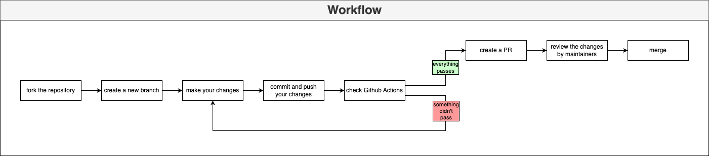

# Contributing to DockCraft
Thank you for your interest in contributing to DockCraft! This document provides guidelines and rules to ensure a smooth and effective contribution process.

## Contribution Guidelines
### **1. Who Can Contribute**

At this time, contributions to DockCraft are restricted to a specific group of individuals. If you are not on the list of authorized contributors, please refrain from submitting pull requests or making changes to the codebase. If you are interested in contributing and would like to be considered for authorization, please write us an <a href="mailto:contact@stefanlacher.com?cc=lacherstefan@outlook.de&subject=I%20want%20to%20contribute%20to%20your%20project%20DockCraft&body=Hi%2C%20I%20want%20to%20contribute%20to%20your%20project%20DockCraft.%20I%20am%20a%20developer%20and%20I%20would%20like%20to%20help%20you%20with%20the%20development.%20I%20am%20looking%20forward%20to%20your%20response.">E-Mail</a> 
with details of your interest and experience.

### **2. Setting Up Your Development Environment**

- Clone the repository:
    ```bash
    git clone https://github.com/stefan.lacher/dockcraft.git
    ```
- Navigate to the project directory:
    ```bash
    cd dockcraft
    ```
- Create a virtual environment:
    ```bash
    python3 -m venv env
    source env/bin/activate
    ```

- Install the required dependencies:
    ```bash
    pip install -r requirements.txt
    ```

### **3. Making Changes**

Fork the Repository: 

If you are an authorized contributor, start by forking the repository to your GitHub account.

Create a Branch: Create a new branch for your changes. Use a descriptive name, such as feature/cool-new-feature or bugfix/fix-issue-123.

```bash
git checkout -b feature/cool-new-feature
```

Make Your Changes: Implement your changes following the project's coding standards. Be sure to include comments and update any relevant documentation.

Commit Your Changes: Write clear, concise commit messages following the [conventional commits](https://www.conventionalcommits.org/en/v1.0.0/) format.

```bash
git commit -m "feature: added the new feature"
```

Push to Your Fork: Push your changes to your fork on GitHub.

```bash
git push origin feature/cool-new-feature
```
Submit a Pull Request: Once your changes are complete and tested, submit a pull request (PR) to the main branch of the original repository. Include a detailed description of your changes and link any related issues.

### **4. Reviewing Process**

Code Reviews: All contributions will be reviewed by project maintainers. Ensure your PR addresses any feedback and passes all CI checks.

Automated Tests: Please include tests for new features or bug fixes. The unit tests have a minimum coverage of 80%. You can run the tests and check the coverage with:
```bash
pytest --cov=your_module tests/
```
Ensure that all existing tests pass before submitting your PR.


### **5. The Workflow visually described**



### **6. Code of Conduct**

All contributors must follow our [Code of Conduct](CODE_OF_CONDUCT.md), which is designed to foster a positive, respectful, and productive community. Violations of the Code of Conduct may result in being banned from the project.

### **7. Licensing**

By contributing to DockCraft, you agree that your contributions will be licensed under the MIT License. The full text of the license can be found in the [LICENSE](LICENSE) file in this repository.

### **8. Contact**

If you have any questions about contributing or need further assistance, please reach out to Stefan via <a href="mailto:contact@stefanlacher.com?cc=lacherstefan@outlook.de&subject=I%20have%20a%20question%20to%20your%20project%20DockCraft">E-Mail</a> .

---
Thank you for your contributions to DockCraft!
